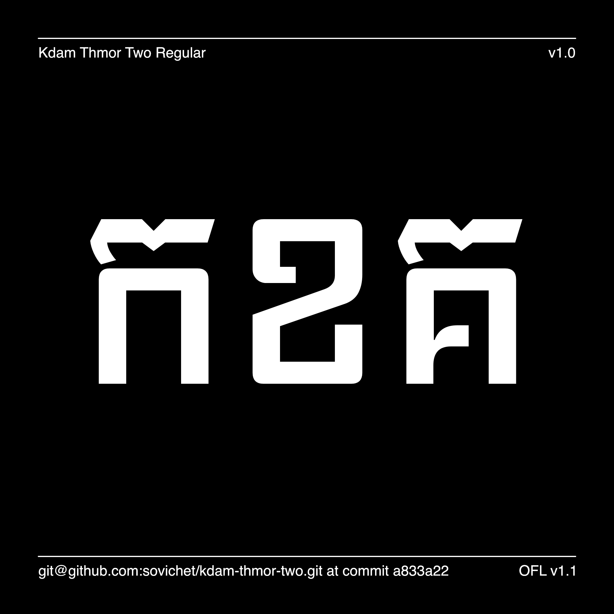

# Kdam Thmor Pro

[![][Fontbakery]](https://sovichet.github.io/kdam-thmor-pro/fontbakery/fontbakery-report.html)
[![][Universal]](https://sovichet.github.io/kdam-thmor-pro/fontbakery/fontbakery-report.html)
[![][GF Profile]](https://sovichet.github.io/kdam-thmor-pro/fontbakery/fontbakery-report.html)
[![][Outline Correctness]](https://sovichet.github.io/kdam-thmor-pro/fontbakery/fontbakery-report.html)
[![][Shaping]](https://sovichet.github.io/kdam-thmor-pro/fontbakery/fontbakery-report.html)

[Fontbakery]: https://img.shields.io/endpoint?url=https%3A%2F%2Fraw.githubusercontent.com%2Fsovichet%2Fkdam-thmor-pro%2Fgh-pages%2Fbadges%2Foverall.json
[GF Profile]: https://img.shields.io/endpoint?url=https%3A%2F%2Fraw.githubusercontent.com%2Fsovichet%2Fkdam-thmor-pro%2Fgh-pages%2Fbadges%2FGoogleFonts.json
[Outline Correctness]: https://img.shields.io/endpoint?url=https%3A%2F%2Fraw.githubusercontent.com%2Fsovichet%2Fkdam-thmor-pro%2Fgh-pages%2Fbadges%2FOutlineCorrectnessChecks.json
[Shaping]: https://img.shields.io/endpoint?url=https%3A%2F%2Fraw.githubusercontent.com%2Fsovichet%2Fkdam-thmor-pro%2Fgh-pages%2Fbadges%2FShapingChecks.json
[Universal]: https://img.shields.io/endpoint?url=https%3A%2F%2Fraw.githubusercontent.com%2Fsovichet%2Fkdam-thmor-pro%2Fgh-pages%2Fbadges%2FUniversal.json

## About

Kdam Thmor Pro is a revised design of "Kdam Thmor" which is one of Sovichet Tep's typefaces designed and published back in 2013 on Google Fonts. 

Kdam Thmor Pro is a modern display Khmer typeface based on the writing style of a brush used on a wall. It has an edgy style, a medium size and is suitable for headings and large typography. In this new version, Gemunu Libre's Latin is used as the Latin counterpart in the project.

This update is made possible with the funding from Google Fonts and continuos support from Dave Crossland and the team at Google Fonts. Also, thanks to Cadson Demak team for the coordination in this project.

Kdam Thmor Pro is designed by Sovichet Tep and Longdey Hak.

## Building

Fonts are built automatically by GitHub Actions - take a look in the "Actions" tab for the latest build.

If you want to build fonts manually on your own computer:

* `make build` will produce font files.
* `make test` will run [FontBakery](https://github.com/googlefonts/fontbakery)'s quality assurance tests.
* `make proof` will generate HTML proof files.

The proof files and QA tests are also available automatically via GitHub Actions - look at https://sovichet.github.io/kdam-thmor-pro.git.

## Changelog

## License

This Font Software is licensed under the SIL Open Font License, Version 1.1.
This license is copied below, and is also available with a FAQ at
https://scripts.sil.org/OFL

## Repository Layout

This font repository structure is inspired by [Unified Font Repository v0.3](https://github.com/unified-font-repository/Unified-Font-Repository), modified for the Google Fonts workflow.
